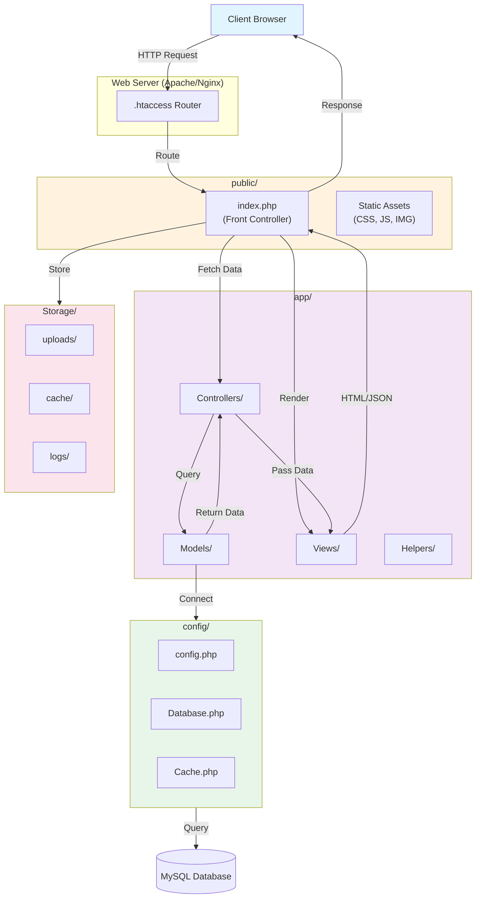
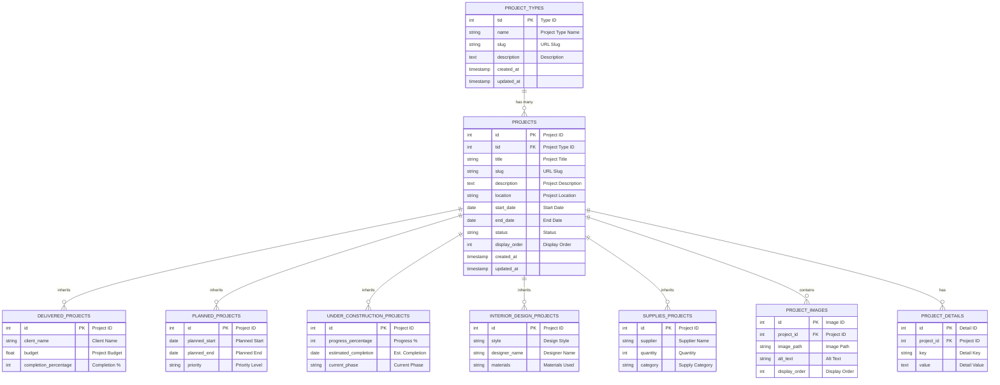
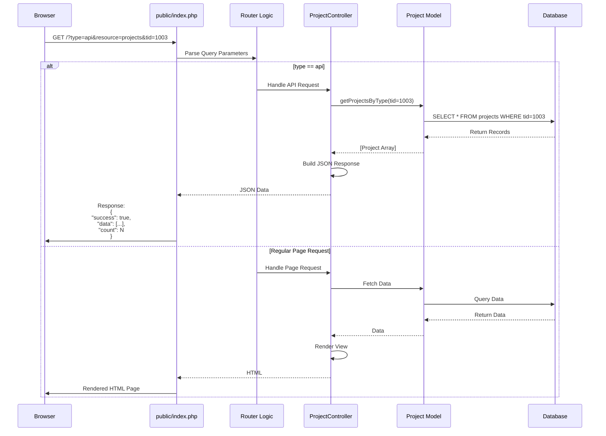
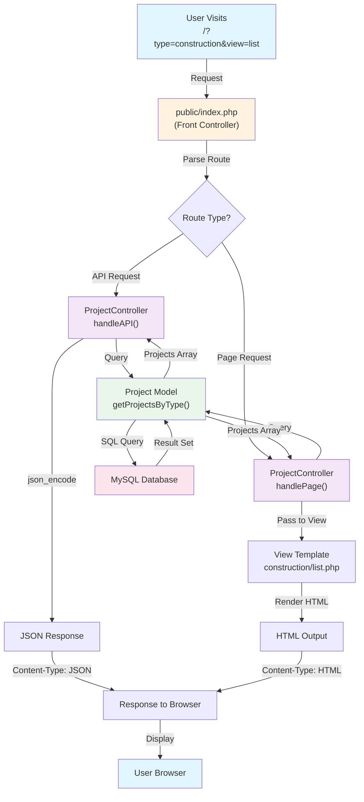
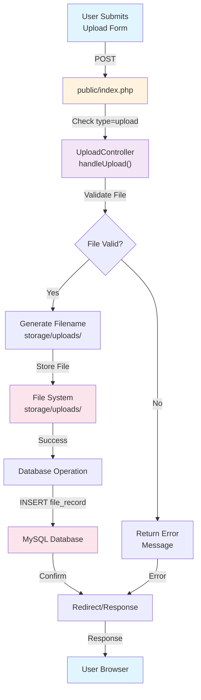
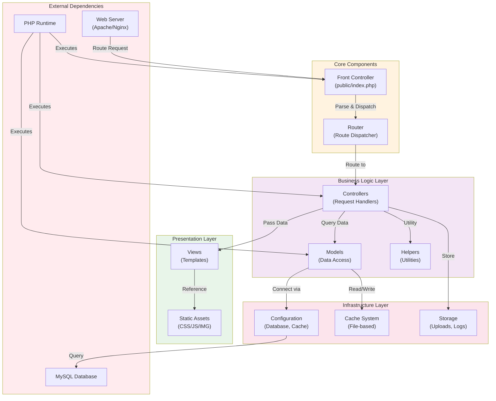
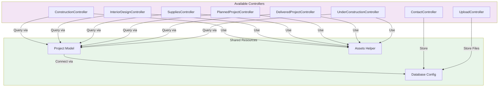
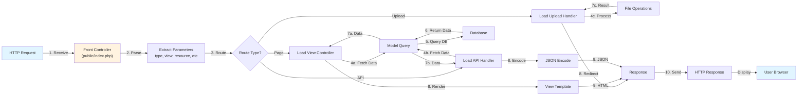

# Alkayan Nova (PHP Project)

This repository contains a document for Alkayan Construction Nova, it runs on business tier, built with a simple MVC-like structure (controllers, models, views) and a public entry point under `public/`.

## Features

- Project pages grouped by type (delivered / planned / under construction / interior / supplies)
- JSON API endpoint for projects (used by frontend rendering)
- Server-side routing via a single front controller (`public/index.php`)
- Basic security hardening headers

## Project Structure

- `public/` — Web root / front controller and public assets
  - `public/index.php` — main router/dispatcher + early JSON API handling
- `app/` — application code
  - `controllers/` — request handlers
  - `models/` — database queries and domain logic
  - `views/` — page templates and view components
  - `helper/` — shared helpers (e.g., assets)
- `config/` — configuration and database connection
- `errors/` — static error pages
- `cache/` — runtime cache files
- `storage/` — storage uploads

## Local Development

1. Ensure PHP + MySQL are available.
2. Update database credentials in `config/config.php`.
3. Point your web server to this project root (see `/.htaccess` and `public/.htaccess`).
4. Visit:
   - `/<type>` pages (e.g., `/?type=construction&view=list` depending on routing usage)

## JSON API (Projects)

The application exposes a projects API directly from `public/index.php`.

Example:

- `/?type=api&resource=projects&tid=1003&page=1`

This returns JSON for the requested project type id (`tid`) and pagination.

## System Architecture

## Entity-Relationship Diagram

## Authentication Flow

> **Note:** Authentication and identity management are decoupled from this core application. Authentication services have been migrated to a dedicated subdomain (`realstate.alkayan-co.com`) and are operated as an independent microservice/server module.

## API Endpoints & Request-Response Flow

### Request-Response Flow

## Data Flow Diagrams

### Project Listing Data Flow

### File Upload Data Flow

## Component Interaction

### Component Dependency Map

### Controller Interaction Diagram

### Request Processing Workflow

## License

MIT License. See `LICENSE`

